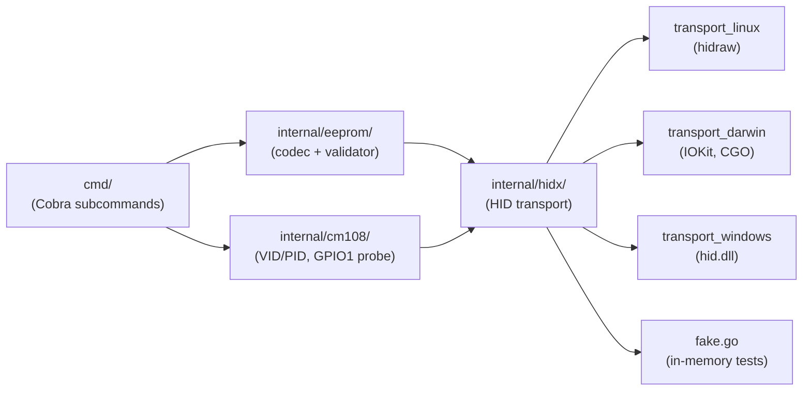
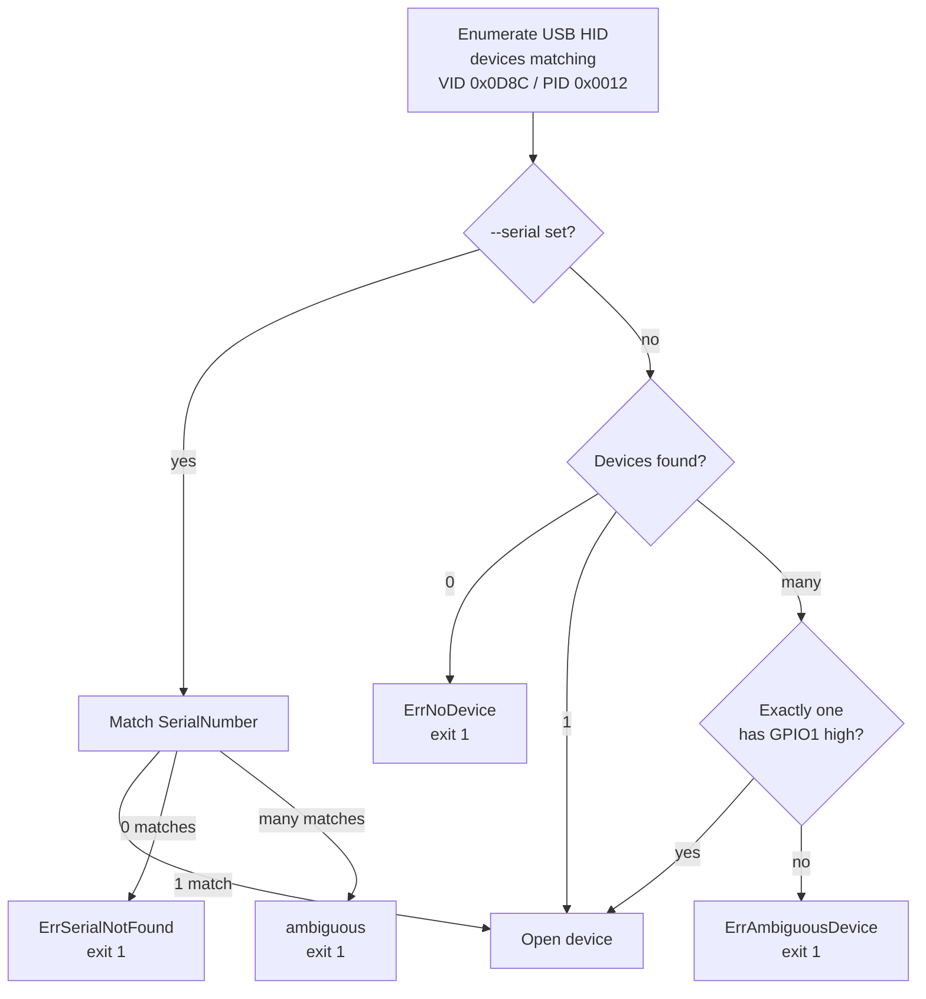
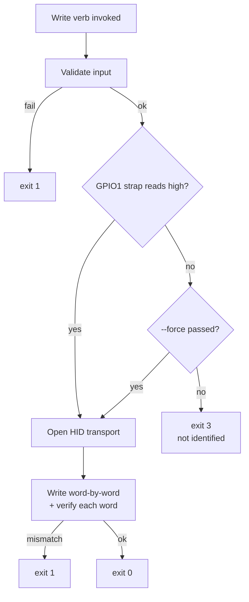

# openvlm CLI Reference

Complete user reference for `openvlm`, the cross-platform CLI for reading, writing, and validating the EEPROM on **OpenVLM USB audio dongles**.

---

## Table of contents

- [Overview](#overview)
- [Installation](#installation)
- [Platform requirements](#platform-requirements)
- [Architecture](#architecture)
- [Quick start](#quick-start)
- [Device selection](#device-selection)
- [Global flags](#global-flags)
- [Exit codes](#exit-codes)
- [Subcommands](#subcommands)
  - [`list`](#list)
  - [`identify`](#identify)
  - [`read`](#read)
  - [`dump`](#dump)
  - [`write`](#write)
  - [`update`](#update)
  - [`provision`](#provision)
  - [`wipe`](#wipe)
- [Write-safety model](#write-safety-model)
- [EEPROM field reference](#eeprom-field-reference)
- [YAML schema](#yaml-schema)
- [Common workflows](#common-workflows)
- [Troubleshooting](#troubleshooting)
- [References](#references)

---

## Overview

`openvlm` programs the on-board EEPROM of OpenVLM USB audio dongles. The hardware is a **C-Media CM108B** USB audio chip wired to a **93C46 SPI EEPROM** (64 × 16-bit words, 128 bytes total), with a **GPIO1 hardware strap** that distinguishes OpenVLM-branded dongles from generic CM108-family devices.

The CLI talks to the chip exclusively over USB-HID class control transfers — there is no kernel driver, no vendor blob, and no platform-specific cable. The same binary runs on Linux, macOS, and Windows.

What it does:

- Enumerates and identifies attached dongles
- Reads / writes the 128-byte EEPROM image
- Decodes the image into a typed view (volumes, USB descriptors, analog config)
- Validates every field before any HID transfer
- Provisions a fresh dongle with canonical OpenVLM defaults
- Wipes a dongle back to factory-blank state

What it does **not** do:

- It does not change a dongle's USB VID/PID (write-locked to `0x0D8C:0x0012`)
- It does not change the product / manufacturer strings (write-locked to `OpenVLM` / `BuildsByShane`)
- It does not work on non-OpenVLM CM108-family dongles unless `--force` is passed

---

## Installation

### Prebuilt binaries (recommended)

Prebuilt binaries are published on the [GitHub Releases page](https://github.com/openmanet/openvlm/releases) for every tagged version. Available targets:

| OS      | Architectures        | CGO     |
|---------|----------------------|---------|
| Linux   | `amd64`, `arm64`     | disabled (fully static binary) |
| macOS   | `amd64` + `arm64` (universal) | enabled (IOKit) |
| Windows | `amd64`              | disabled |

Download the archive, extract, and place `openvlm` (or `openvlm.exe`) somewhere on `$PATH`.

### Build from source

Requires Go 1.26 or newer.

```bash
git clone https://github.com/openmanet/openvlm.git
cd openvlm
make build           # produces bin/openvlm
```

The build chooses CGO automatically based on the host OS (enabled on macOS, disabled on Linux/Windows).

### Cross-compile from macOS to Linux

```bash
GOOS=linux CGO_ENABLED=0 make build
```

---

## Platform requirements

### Linux

`openvlm` opens `/dev/hidrawN` directly via `ioctl`. Out of the box, those nodes are typically owned by `root:root` mode `0600`, so non-root users need a udev rule:

```
# /etc/udev/rules.d/70-openvlm.rules
SUBSYSTEM=="hidraw", ATTRS{idVendor}=="0d8c", ATTRS{idProduct}=="0012", MODE="0660", GROUP="plugdev", TAG+="uaccess"
```

Reload with `sudo udevadm control --reload && sudo udevadm trigger`.

The Linux backend also walks `/sys/bus/usb/devices` to resolve the hidraw node from a USB serial number; `/sys` must be mounted (standard on every modern distro).

### macOS

Standard user permissions are sufficient on Ventura (13) and newer. The macOS build uses CGO to call into IOKit via [hidapi](https://github.com/sstallion/go-hid).

Under heavy host-controller pressure, IOKit can return transient `kIOReturnError` (0xE00002BC) on back-to-back HID reports. The CLI absorbs these with bounded internal retries — no user action needed.

### Windows

Windows 7 or newer. The CLI uses the in-box `hid.dll` and `setupapi.dll`; no driver install or admin rights required.

---

## Architecture



Layering rule: `cmd` calls into `eeprom` and `cm108`; both call into `hidx`. `hidx` knows nothing about CM108B or EEPROMs.

---

## Quick start

```bash
# 1. See what's plugged in
openvlm list

# 2. Confirm the device is an OpenVLM dongle (GPIO1 strap probe)
openvlm identify

# 3. Program canonical OpenVLM defaults onto a fresh dongle
openvlm provision --serial "00001234"

# 4. Inspect the live EEPROM as YAML
openvlm dump --format yaml

# 5. Tweak a single field in place
openvlm update dac-init-volume -6
```

---

## Device selection

Every subcommand selects exactly one device. Selection runs as follows:



Use `--serial <value>` to disambiguate when more than one dongle is plugged in.

---

## Global flags

These flags are accepted by every subcommand:

| Flag             | Default | Description |
|------------------|---------|-------------|
| `--serial <str>` | _empty_ | Pick the device whose USB serial-number string equals this value. Required when more than one dongle is attached. |
| `-v, --verbose`  | `false` | Log every HID transfer to stderr. Use for diagnosing transport-level issues. |

---

## Exit codes

| Code | Name              | Meaning |
|------|-------------------|---------|
| 0    | success           | Operation completed. |
| 1    | failure           | Device not found, HID error, validation failure, file I/O error. |
| 2    | usage error       | Bad flag value, unknown field, invalid input format. |
| 3    | not identified    | Device present, but its GPIO1 strap reads low and `--force` was not passed. |

`identify` is the canonical scriptable check:

```bash
if openvlm identify --serial 00001234; then
    openvlm provision
fi
```

---

## Subcommands

### `list`

```
openvlm list
```

Enumerate every USB HID device matching the OpenVLM VID/PID (`0x0D8C:0x0012`). For each match the CLI probes the GPIO1 strap and reports whether the device is positively identified as OpenVLM hardware.

**Flags:** none beyond the global flags.

**Output (stdout):** tab-separated columns.

```
SERIAL    PATH                                                OPENVLM    NOTE
00001234  /dev/hidraw3                                        yes        
-         /dev/hidraw7                                        no         
```

`OPENVLM` is `yes` if the GPIO1 strap reads high, `no` otherwise. `NOTE` carries the per-device probe error if any.

**Exit codes:** `0` if at least one match found, `1` if none.

---

### `identify`

```
openvlm identify [--serial <value>]
```

Open the selected device, probe the GPIO1 strap, and exit `0` if confirmed, `3` otherwise. Designed for shell scripts.

**Flags:** none beyond the global flags.

**Output (stdout):**

- `<path>: confirmed OpenVLM` on success
- `<path>: NOT confirmed` on strap-low

**Exit codes:** `0` confirmed, `1` device / HID error, `3` strap reads low.

---

### `read`

```
openvlm read [-o <file>]
```

Dump the entire 128-byte EEPROM image as raw binary. The output round-trips bit-for-bit through `openvlm write -i <file>`.

**Flags:**

| Flag             | Default | Description |
|------------------|---------|-------------|
| `-o, --output <file>` | _empty_ | Write the 128-byte image here. If empty, write to stdout. |

**Examples:**

```bash
openvlm read -o backup.bin
openvlm read > backup.bin
```

**Exit codes:** `0` success, `1` device / HID / file error.

---

### `dump`

```
openvlm dump [--format yaml|text|hex]
```

Read the EEPROM and decode it into human-readable form.

**Flags:**

| Flag       | Default | Description |
|------------|---------|-------------|
| `--format` | `yaml`  | Output format: `yaml`, `text`, or `hex`. |

**Formats:**

- **`yaml`** — `PartialView` round-trip format. Pipe directly into `provision --overrides -` or `write -i -` to reapply.
- **`text`** — human-readable table grouped by datasheet section. Good for ad-hoc inspection.
- **`hex`** — raw 128-byte hex dump (`encoding/hex.Dumper` style) for diagnostics.

**Examples:**

```bash
openvlm dump
openvlm dump --format text
openvlm dump --format hex
```

**Exit codes:** `0` success, `1` device / HID error, `2` invalid `--format` value.

---

### `write`

```
openvlm write -i <file|-> [--force]
```

Program the EEPROM from a complete image. Input format is auto-detected: a 128-byte file is treated as raw binary, anything else is parsed as YAML.

**Flags:**

| Flag           | Default | Description |
|----------------|---------|-------------|
| `-i, --input <path>` | _required_ | File path or `-` for stdin. |
| `--force`      | `false` | Bypass the GPIO1 strap safety gate (see [Write-safety model](#write-safety-model)). |

**Behavior:**

1. Read input.
2. If exactly 128 bytes, decode as raw binary; otherwise parse as YAML and merge onto `OpenVLMDefaults`.
3. Validate the resulting view.
4. Verify VID/PID match `0x0D8C:0x0012` (raw images only — hard error even with `--force`).
5. Write word-by-word, reading each word back to verify.

**Examples:**

```bash
openvlm write -i backup.bin
openvlm write -i config.yaml
openvlm write -i config.yaml --force
openvlm dump --format yaml | openvlm write -i -
```

**Exit codes:** `0` success, `1` device / HID / validation / verify error, `2` input format error, `3` strap not confirmed and `--force` not passed.

---

### `update`

```
openvlm update <field> <value> [--force]
```

Read the live EEPROM, change one field, validate the result, and write it back. Single-shot read-modify-write.

**Arguments:**

- `<field>` — one of the kebab-case field names listed in the [EEPROM field reference](#eeprom-field-reference).
- `<value>` — the new value in human form: decimal integer, plain string, `true`/`false`, or one of `12db`/`22db`/`speaker`/`headset`. Hex / octal / binary prefixes are explicitly rejected with a clear error.

**Flags:**

| Flag      | Default | Description |
|-----------|---------|-------------|
| `--force` | `false` | Bypass the GPIO1 strap safety gate. |

**Locked fields** (rejected with "field is not user-programmable"):
`vid`, `pid`, `product-string`, `manufacturer-string`.

**Examples:**

```bash
openvlm update serial "00001234"
openvlm update dac-init-volume -6
openvlm update mic-boost true
openvlm update boost-mode 22db
openvlm update dac-output headset
```

**Note:** undocumented factory data in EEPROM words `0x33..0x3F` is preserved across the read-modify-write cycle.

**Exit codes:** `0` success, `1` device / HID / validation error, `2` unknown field or bad value, `3` strap not confirmed and `--force` not passed.

---

### `provision`

```
openvlm provision [--overrides <file>] [--<field> <value>]... [--dry-run] [--force]
```

Write the compiled-in `OpenVLMDefaults` image to the device, optionally with overrides. This is the canonical command for programming a fresh dongle.

**Flags:**

| Flag            | Default | Description |
|-----------------|---------|-------------|
| `--overrides <file>` | _empty_ | YAML file with a subset of fields to override compiled defaults. |
| `--dry-run`     | `false` | Encode and validate the image, print it as hex, and exit without touching the device. |
| `--force`       | `false` | Bypass the GPIO1 strap safety gate. Required for fresh dongles whose strap has not yet been latched. |

Plus one CLI flag per overridable field — see the [EEPROM field reference](#eeprom-field-reference).

**Override layering** (later wins):

1. `OpenVLMDefaults` (compiled-in)
2. YAML from `--overrides`
3. Per-field CLI flags

**Examples:**

```bash
# Plain provision with compiled defaults
openvlm provision

# Just set the serial number
openvlm provision --serial "00001234"

# Apply a YAML preset
openvlm provision --overrides factory.yaml

# YAML preset, then tweak one field on top
openvlm provision --overrides factory.yaml --dac-init-volume -6

# Validate an image without writing it
openvlm provision --overrides factory.yaml --dry-run

# Bootstrap a fresh, never-programmed dongle
openvlm provision --force
```

**Exit codes:** `0` success, `1` device / HID / validation error, `2` YAML parse or flag error, `3` strap not confirmed and `--force` not passed.

---

### `wipe`

```
openvlm wipe --yes [--pattern FF|00] [--force]
```

Erase the EEPROM by writing a uniform pattern to every word. Returns the chip to a state indistinguishable from factory blank.

**Flags:**

| Flag        | Default | Description |
|-------------|---------|-------------|
| `--yes`     | `false` | **Required.** Confirms intent. There is no interactive prompt; the flag is the prompt. |
| `--pattern` | `FF`    | Byte pattern: `FF` (virgin chip) or `00`. Hex prefix optional (`0xFF` / `0x00`). |
| `--force`   | `false` | Bypass the GPIO1 strap gate (typically required after a wipe — see below). |

**Post-wipe behavior:**

- The magic word at address `0x00` becomes invalid (no longer `0x670X`), so the CM108B falls back to its internal-ROM USB descriptors on the next enumeration.
- The GPIO1 strap probe will start failing, since `IsOpenVLM` relies on the strap reading high after the chip has been programmed at least once.
- **Re-provisioning a wiped device requires `--force`.**

The VID/PID write-lock is intentionally bypassed for this verb — wiping the identity bytes is the whole point.

**Examples:**

```bash
openvlm wipe --yes
openvlm wipe --yes --pattern 00
openvlm wipe --yes --force        # post-provision strap-low devices
```

**Exit codes:** `0` success, `1` device / HID error, `2` missing `--yes` or invalid `--pattern`, `3` strap not confirmed and `--force` not passed.

---

## Write-safety model



**Key invariants:**

- Every write verb (`write`, `update`, `provision`, `wipe`) checks the GPIO1 strap. `--force` is the only documented bypass.
- VID, PID, `product-string`, and `manufacturer-string` are **write-locked at every input layer** (YAML, per-field flags, `update`). The chip always receives the compiled-in OpenVLM identity.
- `wipe` is the sole exception to the VID/PID write-lock — it is allowed to overwrite identity bytes because that is its purpose.
- All writes are read-back-verified word by word.

---

## EEPROM field reference

These are the user-facing fields. Each one is settable via YAML, via `openvlm update <name> <value>`, and (for `provision`) via `--<name> <value>` / `--no-<name>`.

| Field | Type | Range / values | Default | Notes |
|-------|------|----------------|---------|-------|
| `serial` | string | ≤12 printable ASCII (0x20–0x7E) | `""` | USB serial-number string. |
| `serial-enable` | bool | true / false | `false` | Present the USB serial-number string descriptor. |
| `extended-fields-valid` | bool | true / false | `true` | Mark words 0x2A / 0x2B / 0x32 fields as valid. Must be `true` for the chip to honor any of the volume / analog config below. |
| `dac-init-volume` | int (dB) | -37..0 | `-10` | Playback initial volume. |
| `adc-init-volume` | int (dB) | -12..23 | `8` | Recording initial volume. |
| `aa-init-volume` | int (dB) | -16..8 | `-7` | Analog mixer (sidetone) initial volume. **Range narrowed from datasheet -23..8** — see "Encoding caveat" below. |
| `dac-min-volume` | int (dB) | -128..127 | `-37` | Playback minimum. |
| `dac-max-volume` | int (dB) | -128..127 | `0` | Playback maximum. |
| `dac-max-min-volume-valid` | bool | true / false | `false` | Honor `dac-min-volume` / `dac-max-volume` from EEPROM. |
| `adc-min-volume` | int (dB) | -128..127 | `-22` | Recording minimum. |
| `adc-max-volume` | int (dB) | -128..127 | `23` | Recording maximum. |
| `adc-max-min-volume-valid` | bool | true / false | `false` | Honor `adc-min-volume` / `adc-max-volume` from EEPROM. |
| `aa-min-volume` | int (dB) | -128..127 | `-23` | Analog mixer minimum. |
| `aa-max-volume` | int (dB) | -128..127 | `8` | Analog mixer maximum. |
| `aa-max-min-volume-valid` | bool | true / false | `false` | Honor `aa-min-volume` / `aa-max-volume` from EEPROM. |
| `boost-mode` | enum | `12db`, `22db` | `12db` | Mic preamp gain stage. |
| `dac-output` | enum | `speaker`, `headset` | `speaker` | USB audio terminal type. |
| `mic-boost` | bool | true / false | `true` | Enable mic preamp. |
| `mic-high-pass-filter` | bool | true / false | `true` | Enable mic input high-pass filter. |
| `mic-pll-adjust` | bool | true / false | `false` | Enable mic PLL frequency adjust. |
| `dac-shutdown` | bool | true / false | `false` | Shut down DAC analog circuits. |
| `total-power-control` | bool | true / false | `false` | Enable total power control. |
| `hid-enable` | bool | true / false | `true` | Enable USB HID interface (volume buttons, GPIO). |
| `remote-wakeup` | bool | true / false | `false` | Enable USB remote-wakeup capability. |

**Cross-field constraints** (enforced by the validator before any HID transfer):

- `min ≤ max` for each volume range (DAC, ADC, AA).
- `init` value must lie inside `[min, max]` for each volume range.

**Write-locked fields** (rejected by all input layers):

| Field                | Locked value         |
|----------------------|----------------------|
| `vid`                | `0x0D8C`             |
| `pid`                | `0x0012`             |
| `product-string`     | `OpenVLM`            |
| `manufacturer-string`| `BuildsByShane`      |

**Numeric input format:** decimal only. The `0x`, `0o`, and `0b` prefixes are explicitly rejected with the message `hex/binary/octal numeric input is not accepted; use decimal`. This applies to `update`, per-field flags, and YAML.

**Encoding caveat for `aa-init-volume`:** the datasheet documents a -23..8 dB range, but the current encoder uses a 5-bit two's-complement field (range -16..15). The validator deliberately accepts only -16..8, the intersection of the datasheet range and the encoder's faithful range, so values that would silently corrupt cannot be programmed. The two encoded values 9..15 are rejected as out-of-datasheet; -23..-17 are rejected as out-of-encoder. This narrowing will be revisited once the encoding is verified on real hardware.

---

## YAML schema

YAML is the canonical override format. Field names are kebab-case, exactly matching the names in the [EEPROM field reference](#eeprom-field-reference). All fields are optional — anything you omit picks up the value from `OpenVLMDefaults` (for `provision`) or the live EEPROM (for `write`).

Example:

```yaml
serial: "00001234"
dac-init-volume: -6
adc-init-volume: 12
aa-init-volume: 0
boost-mode: 22db
dac-output: headset
mic-boost: true
mic-high-pass-filter: true
hid-enable: true
remote-wakeup: false
```

**Strict parsing:**

- Unknown keys are rejected.
- Write-locked keys (`vid`, `pid`, `product-string`, `manufacturer-string`) are rejected at parse time with a fixed error message.
- Numeric values must be decimal — no hex / octal / binary prefixes.

**Round-trip:**

```bash
openvlm dump --format yaml > config.yaml
# edit config.yaml
openvlm provision --overrides config.yaml
```

```bash
openvlm dump --format yaml | openvlm write -i -
```

---

## Common workflows

### Backup and restore (raw binary)

```bash
openvlm read -o backup.bin
# ...time passes, dongle is reflashed or moved...
openvlm write -i backup.bin
```

### Backup and restore (YAML)

```bash
openvlm dump --format yaml > config.yaml
openvlm provision --overrides config.yaml
```

YAML is human-readable and portable across hardware revisions; raw binary is bit-exact.

### Provision a brand-new dongle

A virgin chip's GPIO1 strap reads low until it has been programmed at least once. The `--force` bypass is required for the first program cycle:

```bash
openvlm provision --force --serial "00001234"
```

After this, subsequent operations work without `--force`.

### Tweak one field

```bash
openvlm update dac-init-volume -3
openvlm update mic-boost false
openvlm update serial "00009999"
```

### Bulk-edit via YAML

```bash
openvlm dump --format yaml > current.yaml
$EDITOR current.yaml
openvlm provision --overrides current.yaml
```

### Reset a dongle to factory blank

```bash
openvlm wipe --yes
# Re-enumerate (unplug / replug)
openvlm provision --force        # bootstrap defaults back in
```

### Validate without writing

```bash
openvlm provision --overrides candidate.yaml --dry-run
```

Catches every validation error and prints the would-be image as hex; never touches the device.

---

## Troubleshooting

### `no OpenVLM devices found`

- Verify the dongle is plugged in: `lsusb | grep 0d8c:0012` (Linux) or System Information → USB (macOS).
- On Linux, check udev rules — the user must have read/write access to `/dev/hidrawN` for the OpenVLM VID/PID. See [Platform requirements](#platform-requirements).
- The CLI matches strictly on VID `0x0D8C` and PID `0x0012`. Generic CM108-family dongles with different PIDs are not enumerated.

### `ambiguous device` / multiple matches

Pass `--serial` to disambiguate:

```bash
openvlm list                                    # see attached serials
openvlm provision --serial "00001234"
```

### `not identified` (exit code 3)

The selected device's GPIO1 strap reads low. This means either:

- The dongle is not actually OpenVLM hardware (a generic CM108 dongle that happens to share the VID/PID).
- The dongle is OpenVLM hardware but has never been programmed (virgin chips read low). Use `--force` to bootstrap.
- The dongle was wiped recently and the strap latch is no longer set. Use `--force` to re-provision.

### macOS — transient HID errors during long writes

The protocol layer absorbs IOKit's `kIOReturnError` (0xE00002BC) with bounded internal retries. If you still see surfaced errors, run with `-v` to log every transfer; if the retry budget is consistently exhausted, file an issue with the verbose log.

### "field is not user-programmable"

You tried to set a write-locked field (`vid`, `pid`, `product-string`, `manufacturer-string`). These come from compiled-in constants and cannot be changed via the CLI by design.

### "hex/binary/octal numeric input is not accepted"

You passed a value with a `0x`, `0o`, or `0b` prefix. Use plain decimal. This applies everywhere — `update`, per-field flags, and YAML.

---

## References

- **CM108B datasheet** — §7.1.3 documents the EEPROM word layout; §7.4 documents the HID protocol used for control transfers; §8.3 documents the volume step encoding.
- **93C46 EEPROM datasheet** — the underlying SPI EEPROM (64 × 16-bit words).
- **License** — [GPLv3](../LICENSE).
- **Contributor guide** — [CLAUDE.md](../CLAUDE.md).
