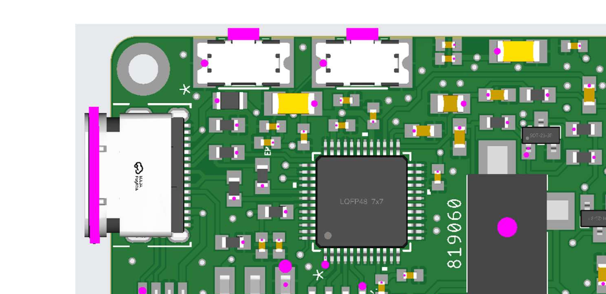
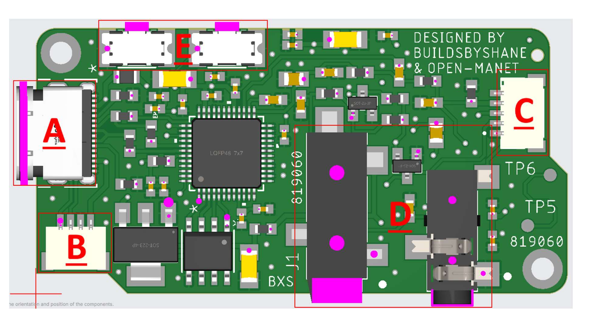
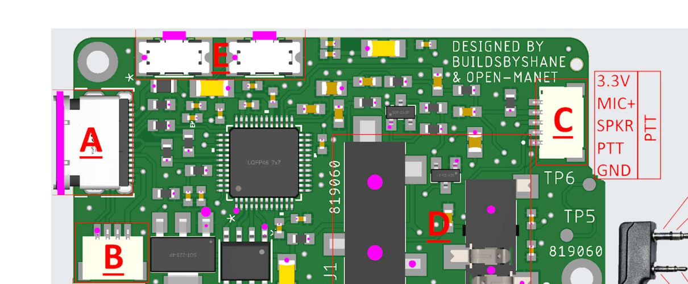
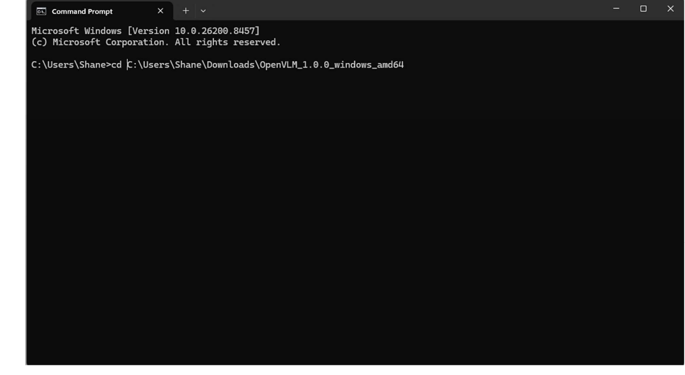
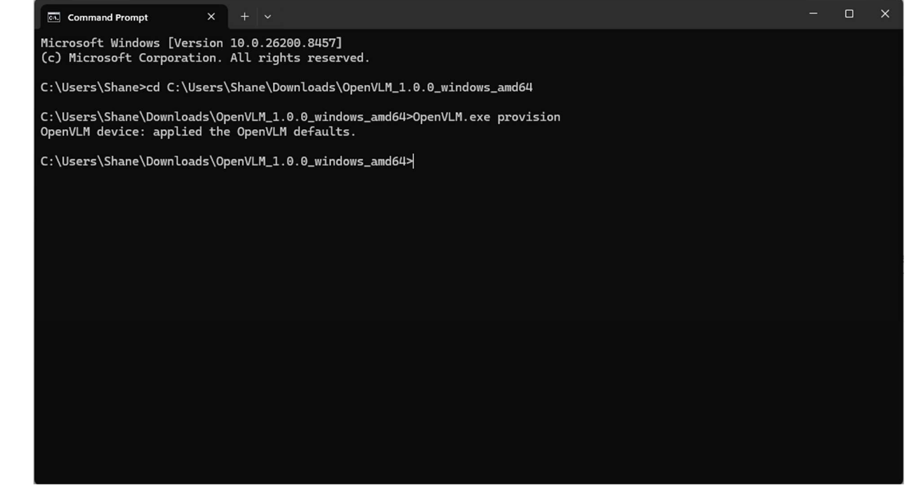

# Voice Link Module (VLM)

## Introduction

Many people already own a preferred PTT designed by companies that focus on
specifically manufacturing just that. VLM was created to allow the push to
talks' that people already own to be easily adapted to USB. VLM uses a
"driverless" audio driver, CM108B and has 3 major functions: audio out
(headset), audio in (mic) and read the PTT button and stores its state in a
readable register through USB communication. This allows the PTT button to be
read without any modifications to the PTT or any other hardware.

## Product Naming

- **A:** Product name abbreviation (Voice Link Module)
- **B:** Product variant abbreviation (Kenwood)
- **C:** Major version number (Version 1)
- **D:** Minor version number (Minor version 0)

## Component Breakdown

- **A:** USB-C
- **B:** 1mm pitch JST USB break out to allow custom USB connections
- **C:** 1mm pitch JST PTT connection to allow custom PTT connections
- **D:** Standard Kenwood PTT connection
- **E:** Hardware volume buttons

### Volume Buttons (E)

Volume Buttons have been added to the latest revision. Currently these are not
configured or working in Open Manet. Planned for future integration.

## JST Pinouts

## Flashing EEPROM

The VLM has onboard EEPROM used for storing data needed for Open-MaNET
detection. This process must be executed before use with Open-MaNET. Boards
will be pre-flashed when ordered through Buildsbyshane.com.

### For Windows

1. Download the flashing application from the Open-MaNET github.
   <https://github.com/OpenMANET/OpenVLM/releases/tag/1.0.0>

2. Extract the downloaded application.

3. Open `cmd.exe`.

4. Navigate to the folder the application is located. `CD *folder path*`

   

5. Connect the VLM to the PC through USB C cable.

6. Enter `OpenVLM.exe Provision`.

   

7. Flashing complete. You should see a message saying "OpenVLM device: applied
   the OpenVLM defaults."

   
